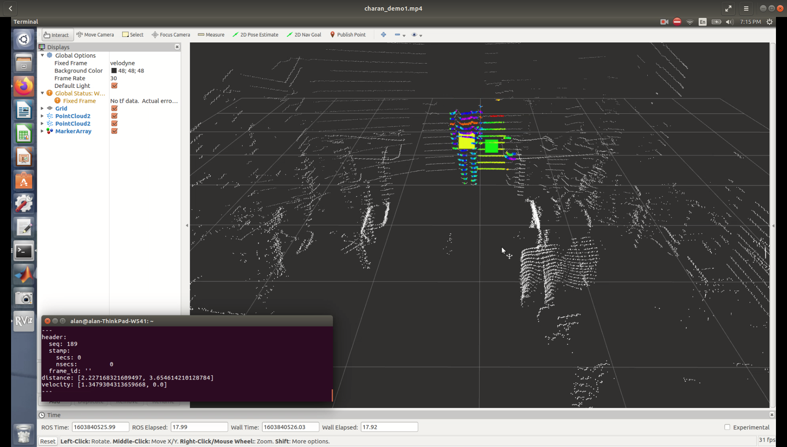
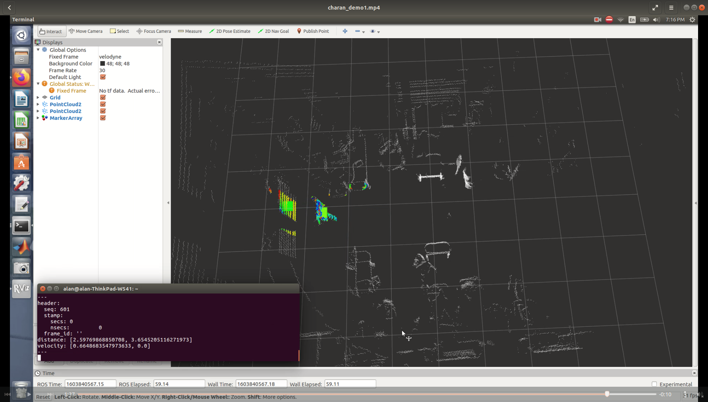

# auto_husky

Tested on ROS Kinetic and Melodic | Ubuntu 16.04 LTS and Ubuntu 18.04.5 LTS

<hr>

Installation:

```console	
$ cd ~/catkin_ws/src/auto_husky
$ chmod +x install_dependencies.sh 
$ ./install_dependencies.sh
```

<hr>

Implementation:

1. Turn on ROS:
```console	
$ roscore
```
2. View published outputs that Husky will use to avoid closest obstacles:
```console	
$ rostopic echo /object_parameters
```
Note: The user has the ability to tune the filtering parameters and select how many objects to track. The size of each output vector matches this number of tracked objects.

3. Run particle_filtering simulation:
```console	
$ roslaunch auto_husky particle_sim.launch
```

4. Run particle_filtering with live LiDAR data:
```console	
$ roslaunch auto_husky particle_live.launch
```

<hr>

Demo:





Note: Greyscale particles are raw data. Rainbow particles are filtered particles. Filtetred particles are clustered together. Big squares denote the center of a detected cluster. They are color-coded from green to red such that green represents static or slow objects and red represents high velocity objects.
